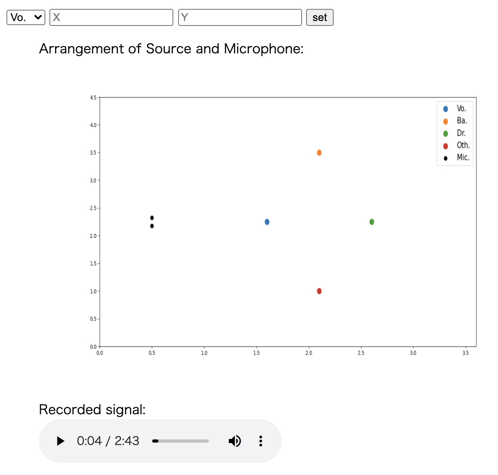

# make-spatial-audio
シミュレーションによる空間音響の作成

## 環境
* シミュレーション環境: Pyroomacoustics ([GitHub](https://github.com/LCAV/pyroomacoustics))

## Usage

* 実行手順
  1. 本リポジトリをダウンロード
  ```
  git clone git@github.com:i14kwmr/make-spatial-audio.git
  ```
  2. データのダウンロード
    * データはWAVファイル
    * 直下に以下の構造のsourceフォルダを作成する．
    ```
    source
    ├ vocals.wav
    ├ bass.wav
    ├ drums.wav
    └ other.wav
    ```
  3. simulate.pyを実行
  ```
  python simulate.py
  ```
  4. localhost:8000にアクセスすると以下の実行画面が表示される．

* 実行画面



## TODO

* [ ] 受け付けた情報をもとに配置を変更する．
